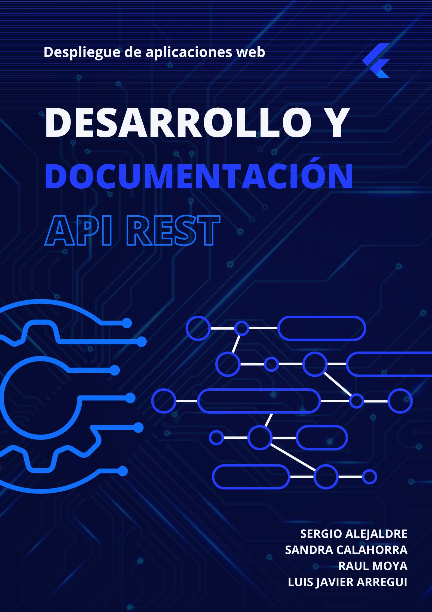

# Índice

- [Inicio](#documentación-api-para-tienda-online)
- [Productos](#productos)
- [Auth](#auth)
- [BiblioGrafia](#bibliografia)

# DOCUMENTACIÓN API PARA TIENDA ONLINE

Bienvenido a la documentación oficial de la API para nuestra tienda online. Esta API proporciona acceso a diversas funcionalidades para gestionar productos y ofrece opciones robustas de autenticación para garantizar la seguridad de los usuarios. A continuación, presentamos una guía completa de los endpoints relacionados con productos y autenticación.

## PRODUCTOS

### Llamada GET por ID

#### Endpoint

 'api/v1/products/{id}'

#### Method

'GET'

#### PARAMETERS

- Path Parameters
    - 'id': Identificador único del producto (tipo: int)

#### RESPONSE
- Code 200: Response Ok.
```json
{
    "id": "int",
    "nombre": "string",
    "categoria": "string",
    "precio": "float",
    "descripcion": "string"
}
```

- Code 404 Not Found.
```json
{
    "error": "Product not found"
}
```

- Code 500 Internal server error.
```json
 {
    "error": "Internal server error"
 }
```
### Modelo

```json
{
    "id": "int",
    "nombre": "string",
    "categoria": "string",
    "precio": "float",
    "descripcion": "string"
}
```
#### Curl


```bash
curl -X GET -H "Authorization: Bearer tu_token_jwt" http://localhost:8080/api/v1/products/{id}

```

### Llamada PUT

#### Endpoint

 'api/v1/products/{id}'

#### Method

'PUT'

#### PARAMETERS

- Path Parameters
    - 'id': Identificador único del producto (tipo: int)
- Headers
    - Authorization: Bearer <Token jwt>
    - Content-Type: 'Application/json'
- Body
```json
{
    "nombre": "string",
    "categoria": "string",
    "precio": "float",
    "descripcion": "string"
}
```

#### RESPONSE
- Code 200: Response Ok.
```json
{
    "id": "int",
    "nombre": "string",
    "categoria": "string",
    "precio": "float",
    "descripcion": "string"
}
```

- Code 400: Bad request.
```json
{
    "error": "The request is not valid"
}
```

- Code 401: Unauthorized.
```json
{
    "error": "The user doesn't have the required authorization"
}
```

- Code 404: Not Found.
```json
{
    "error": "Product not found"
}
```

- Code 500: Internal server error.
```json
 {
    "error": "Internal server error"
 }
```

#### Curl


```bash
curl -X GET -H "Authorization: Bearer tu_token_jwt" http://localhost:8080/api/v1/products/{id}

```
### Llamada DELETE

#### Endpoint
'api/v1/products/{id}'

#### Method
'Delete'

#### Parameters
- Path Parameters
    - 'id': Identificador único del producto (tipo:int)
- Headers
    - Authorization: Bearer <Token jwt>

#### Response
- Code 204: No Content
- Code 401: Unauthorized
```json
{
        "error": "The user doesn't have the required authorization"
    }
```
- Code 404: Not Found
```json
{
    "error": "Product not found"
 }
 ```

- Code 500: Internal Server error
```json
{
    "error": "Internal server error"
 }
 ```

#### Curl

```bash
curl -X DELETE -H "Authorization: Bearer tu_token_jwt" http://localhost:8080/api/v1/products/{id}
```

## Auth

### EndPoint

'api/v1/auth/authenticate'

### Method
'Post'

### Parameters

Body

```json
{
    "user" : "admin",
    "pass" : "admin"
}
```

### Response

- Response Code 200: Ok.

```json
{
    "jwt" : "string"
}
```

- Code 400: Bad Request

```json
    {
        "error": "The request is not valid"
    }
```

- Response Code 404 Conflict.

```json
{
    "error" : "User not found"
}
```

- Response Code 418 I'm a teapot.

```json
{
    "error" : "I'm a teapot, I don't brew coffee 🍵"
}
```

- Response Code 500. Internal server error

```json
{
    "error" : "Internal server error"
}
```

#### Curl

```bash
curl -X POST \
  'URL_DEL_SERVIDOR/api/v1/auth/authenticate' \
  -H 'Content-Type: application/json' \
  -d '{
    "user": "admin",
    "pass": "admin"
  }'
```

### EndPoint

'api/v1/auth/register'

### Method
Post

### Parameters

Body

```json
{
    "user" : "admin",
    "pass" : "admin",
    "name" : "Julio",
    "age" : "56"
}
```

### Response

- Response Code 201: Created.

```json
{
    "jwt" : "string"
}
```

- Code 400: Bad Request

```json
{
    "error": "The request is not valid"
}
```

- Response Code 409 Conflict.

```json
{
    "error" : "User already exists"
}
```

- Response Code 500. Internal server error

```json
{
    "error" : "Internal server error"
}
```

#### Curl

```bash
curl -X POST \
  'URL_DEL_SERVIDOR/api/v1/auth/register' \
  -H 'Content-Type: application/json' \
  -d '{
    "user": "admin",
    "pass": "admin",
    "name": "Julio",
    "age": "56"
  }'
```

## Bibliografia

- Tecnicas Para documentar APIs:

    https://medium.com/@ezinneanne/best-api-documentation-tools-you-need-cf3ef2c47e89

- Codigos de estados de respuestas:

    https://developer.mozilla.org/es/docs/Web/HTTP/Status

- Trabajo sobre documentos con extensión .md
    
    https://www.makeareadme.com/
